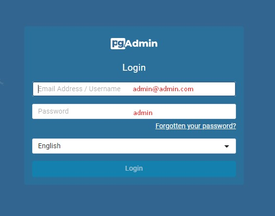
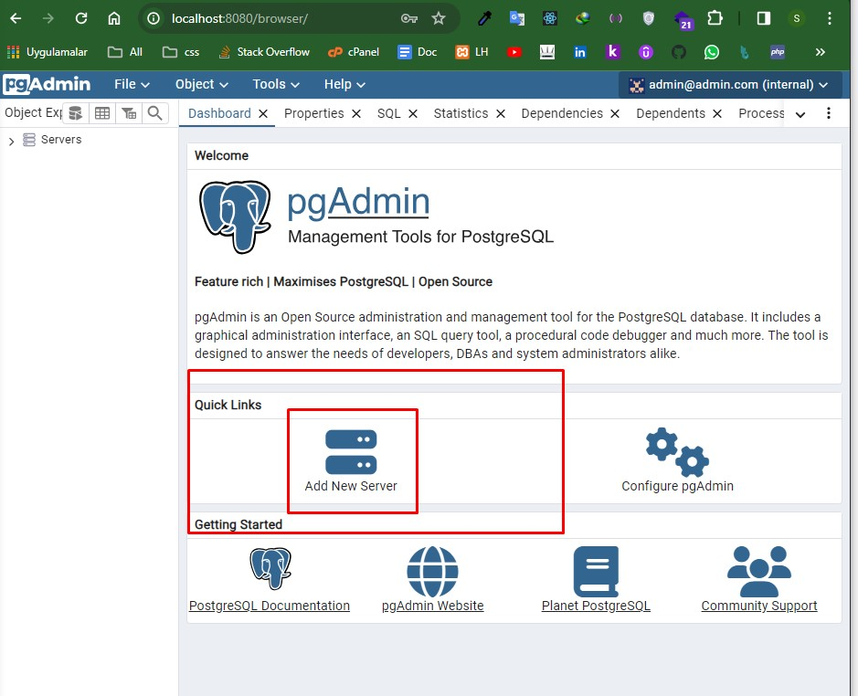
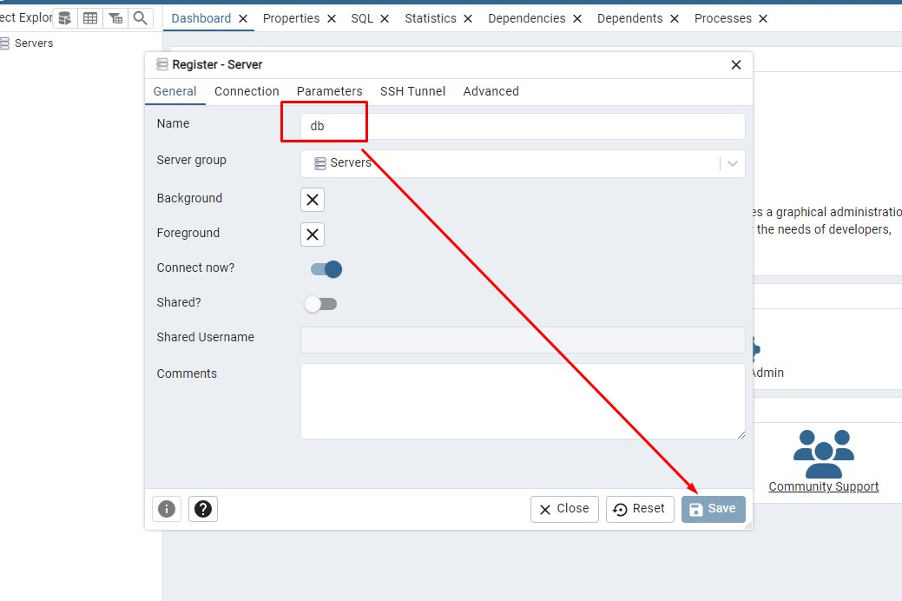
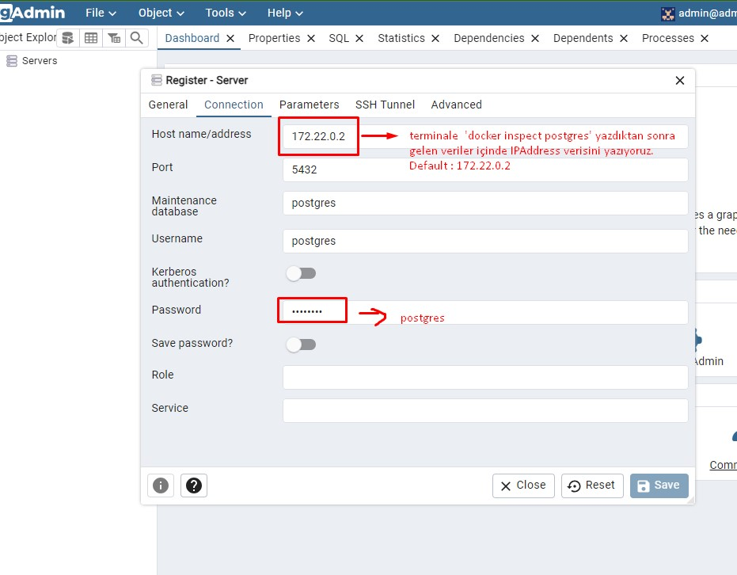

# Anibal RESTful API

## Kurulum

### Ön Gereksinimler

- Docker ve Docker Compose kurulu olmalıdır.

### Kurulum Adımları

1. Bu depoyu klonlayın:

```bash
git clone https://github.com/samealtundag/anibal-task.git
```

2. Proje dizinine gidin ve env dosyasını yeniden yapılandırın:
```bash
cd anibal-task
cp .env.example .env
```
3. Docker konteynerlerini başlatmak için aşağıdaki komutu çalıştırın:
```bash
docker-compose build
docker-compose up -d
```

4. Laravel projesinde gerekli bağımlılıkları yüklemek için Docker konteynerine girin:
```bash
docker-compose exec app bash
```

5. Laravel bağımlılıklarını yüklemek için Composer kullanarak aşağıdaki komutu çalıştırın:
```bash
composer install
```

6. Laravel bağımlılıklarını yüklemek ve veritabanını oluşturmak için aşağıdaki komutu çalıştırın:
```bash
php artisan key:generate
php artisan migrate
php artisan db:seed
```

7. Docker konteynerinden çıkın:
```bash
exit
```

7. Uygulamayı başlatmak için:
`http://localhost:8000/`


## PGADMIN4 ile Tarayıcıda Veritabanı Önizleme

1. Tarayıcınızdan http://localhost:8080/ adresine gidip username: `admin@admin.com` password: `admin` şeklinde giriş yapın



2. Giriş yaptıktan sonra ekrandaki `Add New Server` bölümüne tıklayın


3. Açılan pencerede Name bölümüne `db` yazın:


4. Penceredeki sağ tarafta bulunan `Connection` tablosuna tıklayıp aşağıdaki alanları uygun bir şekilde doldurun:

`Hostname,Database,Username: postgres`
`Port: 5432`
 docker inspect postgres

5. PostgreSQL ile veritabanı oluşturma işleminiz tamamlandı.


## Routes List:

### Articles
- `GET /articles`: Tüm blogları listeler.
- `GET /articles/:slug`: Slug değerine göre blogu listeler.
- `POST /articles/store`: Yeni bir blog oluşturur.
- `PUT /articles/:id`: Belirli bir blogu günceller.
- `DELETE /articles/:id`: Belirli bir blogu siler.

### Auth
- `POST /login`: Giriş yapma işlemi yapar.
- `POST /register`: Kayıt olma işlemi yapar.

### Custom
- `GET /articles/category/:category_slug`: Kategori için filtreleme yapar.
- `POST /articles/search/:search`: Başlık, Slug ve içeriğe göre özel arama yapar.


## RESTful API 

### Articles

| Method     | URI             | Action                     |
|------------|-----------------|----------------------------|
| `POST`     | `api/articles/store`      | `ArticleController@store`  |
| `GET/HEAD` | `api/articles`      | `ArticleController@index`  |
| `GET/HEAD` | `api/articles/{slug}` | `ArticleController@show`   |
| `DELETE`   | `api/articles/{id}` | `ArticleController@destroy`|
| `PUT`      | `api/articles/{id}` | `ArticleController@update` |


### Auth

| Method | URI        | Action                   |
|--------|------------|--------------------------|
| `POST` | `/api/login`    | `AuthController@login`   |
| `POST` | `/api/register` | `AuthController@register`|

### Custom

| Method | URI        | Action                   |
|--------|------------|--------------------------|
| `GET` | `/api/articles/category/{category_slug}`    | `ArticleController@category`   |
| `GET` | `/api/articles/search/{search}` | `ArticleController@search`|
